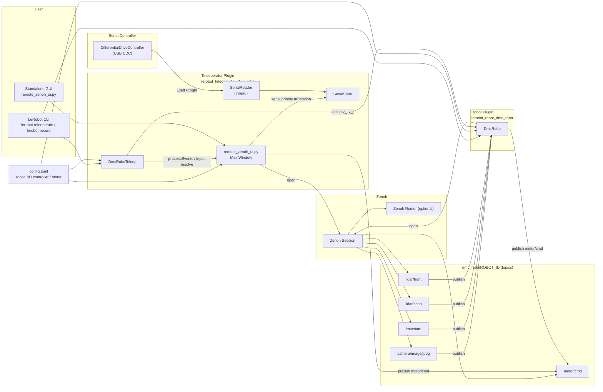

# ソフトウェア構造（Mermaid）

ポイント:
- シリアル入力は `remote_zenoh_ui.py` 内で受け取り、仲裁は「シリアル優先」です。
- GUI単体起動時は UI が `motor/cmd` を直接 publish します。
- `lerobot-teleoperate` 経由では Teleop が UI から入力を取得し、Robot プラグイン経由で `motor/cmd` を publish します。
